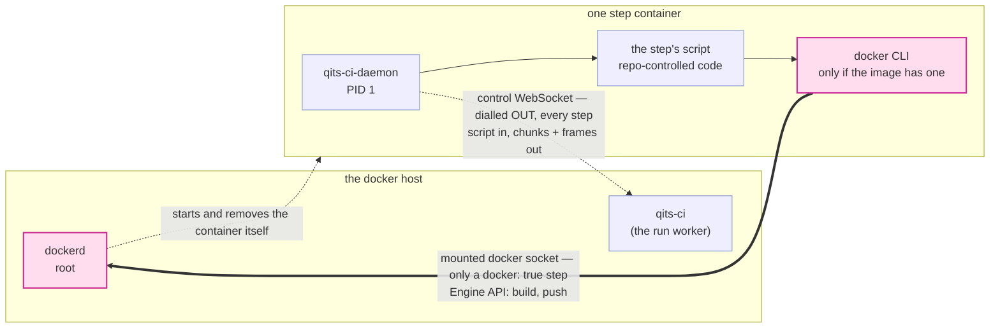

# How a step actually runs — the picture

`README.md`'s **"How a step runs — qits-ci starts containers, and that is all"** is the contract; this
file does not restate it. It exists for one reason: the arrangement has **two sockets that share a
word**, and every reader who meets them in prose has to be told twice which is which. A picture is
cheaper than re-explaining per reader.

| | the control WebSocket | the host's docker daemon socket |
|---|---|---|
| what | `ws://qits-ci:8080/ci/daemon` (`qits.ci.container-daemon-url`) | a unix socket on the host, `qits.ci.docker-socket-path` |
| who opens it | the **step container**, dialling **out**; qits-ci never dials in | nobody opens it — it is bind-mounted into the container as a file |
| which steps have it | **every** step, always, since the daemon landed | only a step that declared `docker: true` |
| what rides it | the step's script one way, output chunks and lifecycle frames the other | the docker Engine API, spoken by whatever CLI the step image carries |
| what it grants | "deliver data about this run", authenticated by a per-container secret | **root on the host** — the socket *is* the daemon |
| if it is missing | the step is recorded `NEVER_STARTED` / `CONNECTION_LOST` | a step that asked for it cannot build or push; every other step never notices |

They are unrelated. The control socket is how a step *is* a step; the docker socket is one optional
privilege a repository can ask for in writing.



The dotted line is the control socket: outbound, per step, always there. The thick line is the docker
socket: a mount, only on a declared step, and root-equivalent. Note that `dockerd` is *also* what
starts the container in the first place — qits-ci has always talked to it, from the host side, as a
CLI client. What `docker: true` changes is that the step gets to talk to it too.

## The whole flow, once

```mermaid
sequenceDiagram
    autonumber
    actor Dev as developer
    participant Git as qits-githost
    participant Bus as qits-events
    participant Art as qits-artifacts
    participant Ci as qits-ci
    participant Dockerd as host dockerd
    participant Step as step container

    Dev->>Git: git push
    Git->>Bus: SCMPublishCommit{repoId, branch, oldSha, sha, …, suppressCi}<br/>through the outbox — durable, so a qits-ci that was down reads it back
    Bus-->>Ci: the frame, or a catch-up sweep of it later
    Note over Ci: suppressCi (git push -o qits.no-ci) ⇒ no run at all
    Ci->>Git: GET /git/{repoId}/blob/{sha}/.config/qits/ci-post-receive.yml<br/>one file at the pushed commit — no clone, no mirror
    Ci->>Ci: parse the steps, pin the daemon version, write the run row RUNNING

    loop one fresh container per step, in sequence
        Ci->>Dockerd: docker run -d --cap-drop=ALL --security-opt=no-new-privileges …<br/>entrypoint = the host-authored BOOTSTRAP, the contract as env
        Note over Ci,Dockerd: a step that declared docker: true also gets<br/>-v /var/run/docker.sock:/var/run/docker.sock here.<br/>Nothing else about the argv differs.
        Dockerd->>Step: started, detached, labelled qits.ci.run=the run id
        Step->>Art: GET $QITS_CI_DAEMON_BINARY_URL → chmod +x → exec
        Step-->>Ci: ⇠ dials the CONTROL WebSocket, Hello{daemonId, secret}
        Note over Step,Ci: the container dials OUT. qits-ci never dials in and<br/>never learns an address from a container.
        Step->>Git: shallow clone --depth 50, checkout $QITS_CI_SHA
        Step-->>Ci: Initialized — or InitFailed{SHA_GONE}, the force-push backstop
        Ci-->>Step: RunStep{script, timeoutSeconds} — the reply IS the step<br/>← host-stamped started_at
        Step-->>Ci: Output{chunk} … many, streamed as the script prints
        Ci->>Ci: each chunk feeds the bounded relay that GET /ci/api/runs/{runId}<br/>exposes as `live` — poll it; there is no SSE and no push
        Step-->>Ci: Finished{exitCode, timedOut} ← host-stamped finished_at
        Ci->>Ci: write the step row ONCE, already terminal
        Ci->>Dockerd: docker rm -f — on every path, including the bad ones
    end

    Note over Ci: a red step skips the rest; the remaining rows are written SKIPPED
    Ci->>Bus: BuildSuccessful — only on SUCCESS; BuildFailed with the terminal word otherwise
```

Three things the diagram is deliberately precise about:

- **The script arrives as a reply.** qits-ci initiates nothing toward a container. The script is a
  field of the frame answering the daemon's own `Initialized`, which is also why it never appears in
  an argv and why the container never receives the config *file* — only its own step.
- **The row is written once, terminal.** While a step runs it has no row at all; `live` is what makes
  that legible instead of looking like a run with missing steps.
- **The last arrow goes to the bus and to nobody in particular.** It used to be a POST to
  qits-platform-deployments' `/events/build-succeeded`, drawn here because a green run *was* a
  deployment. Both halves of that have gone: qits-ci published its last such POST some releases ago,
  and the deployer has since removed the path itself — a green build is no longer a reason to put
  anything live. `BuildSuccessful` is a verdict about a commit now, and its consumer is
  qits-projects' release-request quality gate.

## Where a publishing step fits

```mermaid
sequenceDiagram
    autonumber
    participant Ci as qits-ci
    participant Step as final step container
    participant Dockerd as host dockerd
    participant Reg as qits-artifacts registry
    participant Bus as qits-events
    participant Pd as qits-platform-deployments

    Ci-->>Step: RunStep{script} over the control WebSocket
    Note over Step: the script is just a script:<br/>ref="$QITS_REGISTRY/$QITS_IMAGE_REPOSITORY/APP:$QITS_CI_SHA"<br/>docker build -t "$ref" . && docker push "$ref"
    Step->>Dockerd: build, over the MOUNTED docker socket<br/>(the CLI streams the context; the daemon builds)
    Dockerd->>Reg: PUT blobs + manifest — tokenless for producers
    Step-->>Ci: Output{chunks} — the build log, over the control WebSocket
    Step-->>Ci: Finished{exitCode}
    Ci->>Bus: SoftwareRelease{repoId, projectId, version, package} — one per published declaration
    Bus-->>Pd: the frame, durably; a deployer that was down reads it back
    Pd->>Reg: pull REGISTRY/REPOSITORY/APP:VERSION — the tag convention, unenforced
```

Nothing here is a new mechanism. The push is a step's exit code like any other — a failed push is a
failed step is a failed run, so the announcement (published declarations only) keeps implying the
image exists. **What the deployer hears is the release and not the build**: it subscribes to
`SoftwareRelease`, so a repository whose pipeline publishes nothing deploys nothing, however green
it goes. Its HTTP intake still takes a `POST /platform-deployments/api/events/software-released`,
and that door is a bootstrap's and an operator's — qits-ci calls it never.

`$QITS_REGISTRY` and `$QITS_IMAGE_REPOSITORY` are injected into *every* step container so the script
names no deployment fact; `$QITS_CI_SHA` was already there.

And note who dials the registry in that diagram: **`Dockerd`, not `Step` and not `Ci`.** The CLI on
the far side of the mounted socket is a client; the host's daemon is what resolves the registry name,
negotiates TLS and performs both the build and the push. That is why the deployment prerequisite is
about the *docker host's* view of the registry — resolvable from there, and in
`insecure-registries` while it speaks plain HTTP.
